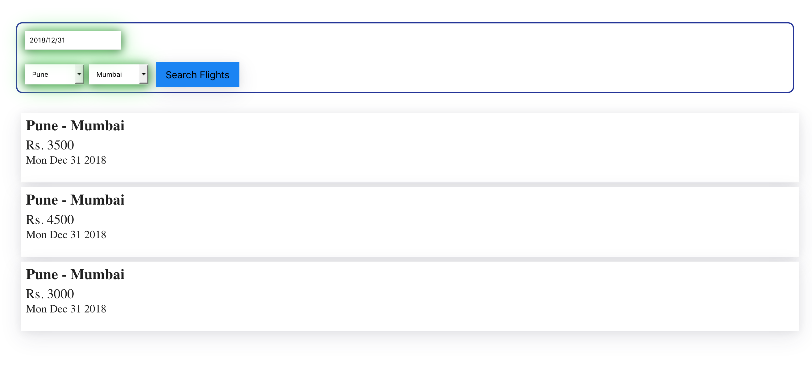

## This is a minimal React-Redux-Typescript application to search for flights from a JSON data store and display lists of flights

## How it looks on initial load
 

## Technology stack
* [gulp](http://gulpjs.com/)
* [webpack](https://webpack.js.org/)
* [TypeScript (2.2.2)](http://www.typescriptlang.org/)
* [react.js](https://facebook.github.io/react/)
* [Sass](https://sass-lang.com/) + [autoprefixer](https://github.com/postcss/autoprefixer)
* [browser-sync](https://www.browsersync.io/)
* [redux](http://redux.js.org/) + [react.js bindings](https://github.com/reactjs/redux)
* [react router dom](https://www.npmjs.com/package/react-router-dom)

